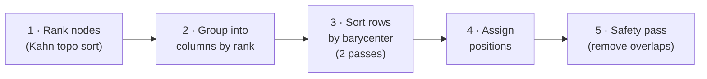

# Auto-layout

A **layered DAG** algorithm that assigns [[nodes]] to columns by rank and rows by parent barycenter. Toggled with `a` or the toolbar button.

## Algorithm



### Step 1 — Rank

Kahn's topological sort with `rank = max(parent rank) + 1`. Roots (in-degree 0) get rank 0.

### Step 2 — Column grouping

Nodes with the same rank share a column. Initial row order within a column: **flow index first** (nodes of the same [[flows|flow]] cluster together), then current `y` position (preserves relative order on repeated layouts).

### Step 3 — Barycenter sort

Two left-to-right passes. Each non-root column's rows are re-sorted by the **mean row index of their parents** in the previous column. This is the standard Sugiyama crossing-minimisation heuristic.

### Step 4 — Position assignment

| Axis | Spacing | Formula |
|------|---------|---------|
| Horizontal | 128px per rank | `rank × (72 + 56)` |
| Vertical | 96px per row | `startY + i × (72 + 24)` |

All columns are **vertically centred** against a common axis (the tallest column's midpoint), so flows read straight across rather than zig-zagging.

### Step 5 — Safety pass

Collision check using a `"x,y" → id` occupied map. If two nodes land on the same point (shouldn't happen under normal conditions), the later one is bumped down by one row gap.

## Behaviour while on

- Node dragging is **disabled** — taps still work
- `maybeReflow()` re-runs the layout after every graph mutation (node add/delete, edge add/delete)
- The `layout-anim` CSS class is added briefly during mode switches for a 240ms position transition

## Integration with view specs

> [!IMPORTANT]
> `commitActiveViewSpec()` is always called **before** `applyAutoLayout()`. This guarantees the freeform positions are safely stored and can be restored when auto-layout is turned off.

```
toggle ON:  commitActiveViewSpec()  →  applyAutoLayout()
toggle OFF: applyViewSpec(active)
```

See [[view-specs#Interaction with auto-layout]] for the full design rationale.

## Related

- [[nodes]] — positions overwritten during layout
- [[edges]] — `maybeReflow` fires after edge mutations
- [[flows]] — flow index used as initial row-sort key
- [[view-specs]] — freeform positions saved/restored around layout sessions
- [[canvas]] — positions are in world space
