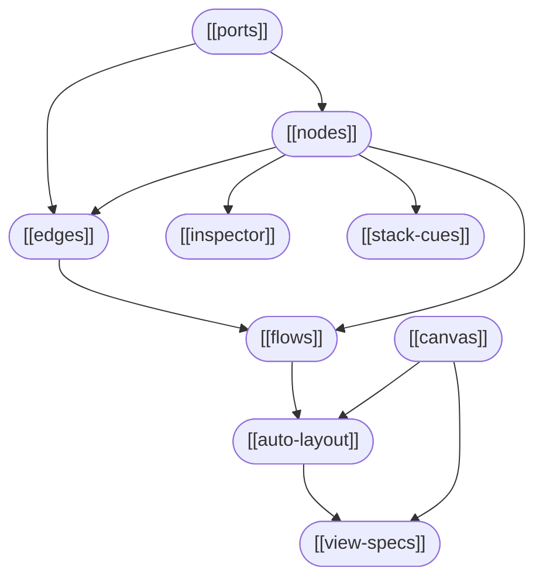

# polyp

Node-based flowchart programming UI — Electron app wrapping a single-file HTML prototype.

> [!ABSTRACT] Quick orientation
> Nodes connect left-to-right via ports. Connections form directed flows. The graph is always a DAG. Layout can be computed automatically or arranged manually across three saved view specs.

## Core concepts

| Note | Summary |
|------|---------|
| [[nodes]] | The fundamental unit — script / lens / camera |
| [[edges]] | Directed connections between node ports |
| [[flows]] | Connected components, colour-coded |
| [[ports]] | Input/output connection points; drag mechanics |
| [[inspector]] | Per-node detail panel |
| [[auto-layout]] | Computed layered-DAG positioning |
| [[view-specs]] | Three named freeform layout slots |
| [[stack-cues]] | Visual treatment of overlapping nodes |
| [[canvas]] | Pan, zoom, coordinate spaces |

## Reference

| Note | Summary |
|------|---------|
| [[keyboard-shortcuts]] | Every key, mouse, and touch action |
| [[usage]] | Practical guide — building graphs, layout modes |

## Design decisions

| Note | Summary |
|------|---------|
| [[view-specs]] | Copy-on-first-visit, lazy commit, auto-layout integration |

---

