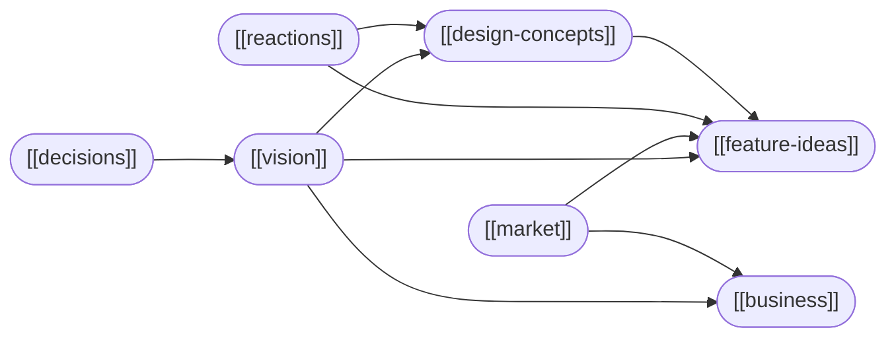

# polyp

Node-based flowchart programming UI — Electron desktop app, dark, keyboard-first, aiming to become a substrate for domain modeling, context gathering, and agentic workflow engineering.

> [!ABSTRACT] Start here
> New to this KB? Read [[vision]] for what polyp is trying to be, then browse the concept notes below. For practical use, start with [[usage]] and [[keyboard-shortcuts]].

---

## Workstream

| Note | Purpose |
|------|---------|
| [[vision]] | What polyp is + what it's trying to become |
| [[decisions]] | Chronological log of design and engineering decisions |
| [[feature-ideas]] | Backlog — near/medium/long/wild |
| [[design-concepts]] | Visual, interaction, and architectural explorations |
| [[market]] | Related tools, prior art, competitive landscape |
| [[business]] | Startup angles, monetization, product strategy |
| [[reactions]] | Likes, dislikes, curious — living gut-reaction log |
| [[ui-ideas]] | UI/UX ideas log — introduced, evolved, shipped, cut |
| [[ws-wow]] | Workstream way of working — principles, rituals, working contract ("polyps") |

## Planning

| Note | Summary |
|------|---------|
| [[todo]] | Current sprint — in progress and near-term items |
| [[roadmap]] | Milestones 0–8, prototype to platform |

## Engineering

| Note | Summary |
|------|---------|
| [[user-action-tracking]] | Semantic event log, JSONL export, replay design, Pydantic schemas |
| [[tech-stack]] | Current stack with evolution history and rationale |
| [[tech-stack-research]] | Alternatives and lookahead for every current choice |

## Workstream automation

| Note | Summary |
|------|---------|
| [[workstream-automation-git]] | Two-repo git strategy, commit conventions |
| [[workstream-automation-github]] | GitHub Actions, Issues, Pages, Releases |
| [[workstream-automation-neocities]] | Dev log publishing to Neocities |
| [[workstream-automation-twitter]] | Milestone and design observation tweets |
| [[workstream-automation-polyp]] | **Meta**: using polyp itself to automate the polyp workstream |

## Core concepts

| Note | Summary |
|------|---------|
| [[nodes]] | The fundamental unit — script / lens / camera |
| [[edges]] | Directed connections between node ports |
| [[flows]] | Connected components, colour-coded |
| [[ports]] | Input/output connection points; drag mechanics |
| [[inspector]] | Per-node detail panel |
| [[auto-layout]] | Computed layered-DAG positioning |
| [[view-specs]] | Three named freeform layout slots |
| [[stack-cues]] | Visual treatment of overlapping nodes |
| [[canvas]] | Pan, zoom, coordinate spaces |
| [[chrome]] | Topbar and statusbar — every element, live vs static, design rationale |

## Reference

| Note | Summary |
|------|---------|
| [[keyboard-shortcuts]] | Every key, mouse, and touch action |
| [[usage]] | Practical guide — building graphs, layout modes |

---

## Architecture diagram

## Workstream graph

